# 🗺️ WarRoom Factory Lite Graph

```mermaid
graph TD
    %% Tiers definition
    classDef micro fill:#4d7c0f,stroke:#1a2e05,stroke-width:2px,color:#fff
    classDef lite fill:#a16207,stroke:#422006,stroke-width:2px,color:#fff
    classDef full fill:#991b1b,stroke:#450a0a,stroke-width:2px,color:#fff
    classDef file fill:#1e293b,stroke:#475569,stroke-dasharray: 5 5,color:#e2e8f0
    
    subgraph "Factory Lite Pipeline (WarRoom)"
        A[Idea / Roadmap] -->|/spec| B[Station 1: SPEC]
        B -->|Drafting| B1((docs/specs/))
        B1 -->|Review| B2{Council/User Approval}
        
        B2 -->|Rejected| B1
        B2 -->|Approved| C[Station 2: BUILD]
        
        C -->|/claim-task| C1(Feature Branch)
        C1 -->|/coder| C2(Implementation)
        C2 -->|pnpm run verify| C3{Verification Gate}
        
        C3 -->|Failed| C2
        C3 -->|Pass| D[Station 3: SHIP]
        
        D -->|ship.ps1 v3| D1[Merge to Develop]
        D1 -->|Push| D2[CI: Build & Tests]
        D2 -->|Coolify Webhook| D3[Staging Deploy]
        D3 -->|Health Check| D4{Staging Alive?}
        
        D4 -->|Failed| D5[Rollback & DEBT.md]
        D4 -->|Pass| D6[gh pr create: -> main]
    end

    %% Apply Classes
    class B,C,D lite;
    class B1,C1,D1,D2,D3,D5,D6 file;
```

## Key Workflow Details
- **Station 1:** We generate the spec before moving a single line of code.
- **Station 2:** The actual coding, strictly bound to the branch claimed.
- **Station 3:** The heavy lifting is done explicitly via `scripts/ship.ps1`.
- **Nightly Maintenance:** Not shown above, but autonomously manages dependencies and security audits on a background schedule.
